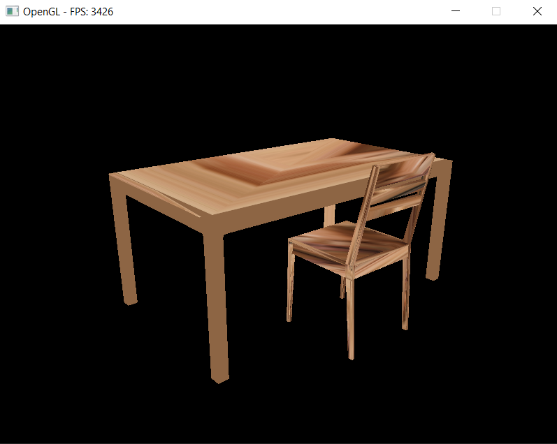

# OpenGL Scene Renderer

## Overview
This project is a lightweight 3D graphics sandbox built using **OpenGL** in **C++**, featuring a controllable **first-person camera**, interactive navigation, and basic object rendering. Developed to explore low-level graphics programming, it integrates key concepts like camera movement, texture mapping, lighting, and shader-driven rendering.

The scene showcases a simple indoor layout with multiple textured models (e.g., cubes, table, chair) and supports interactive exploration using standard FPS-style controls.

---

## Screenshots

1. **Basic Scene Layout**  
     
   *Multiple 3D models rendered in a single scene.*

2. **Textured Cube Example**  
     
   *A cube with a custom texture applied.*

3. **Multiple Textured Models**  
     
   *Scene with multiple textured model instances.*

---

## Features
- **First-Person Camera**: Navigate the 3D environment using keyboard and mouse.
- **3D Object Rendering**: Supports rendering multiple textured models in real time.
- **Texture Mapping**: Load and apply 2D textures to 3D surfaces.
- **Custom Shader Pipeline**: Supporting integrated shaders for lighting and effects.
- **Modular Scene Setup**: Easily extendable to include new models or controls.

---

## Technologies Used
- **OpenGL** – Core 3D rendering
- **SFML** – Windowing and input handling
- **GLM** – Vector/matrix math for transformations and camera movement
- **C++** – Application structure and logic

---

## Installation

1. Open **Visual Studio** and click **"Clone a repository"**.
2. Paste this repo’s URL:  
   `https://github.com/Filip-Rak/OpenGL-Scene-Renderer.git`
3. Unpack the `dependencies.zip` file into the project's **main directory**.
4. Open the `.sln` file and build/run from Visual Studio.

---

## Notes
This basic project was created as an exploratory dive into OpenGL fundamentals and does not represent a fully functional application.

